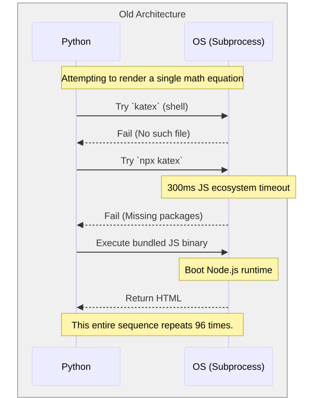
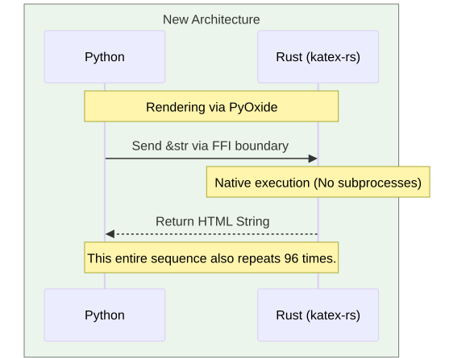
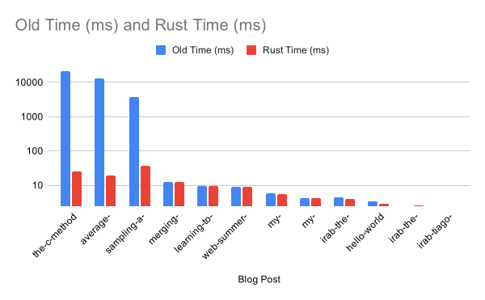
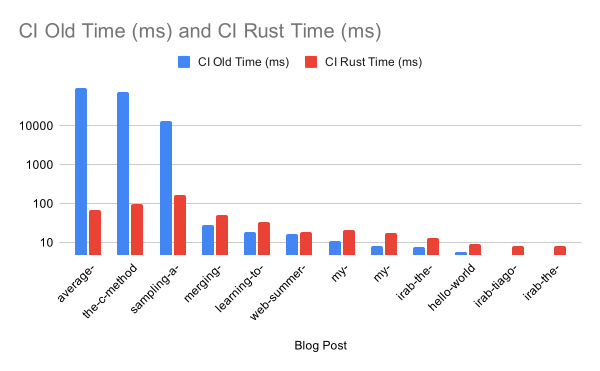

I don't really like to wait more than absolutely necessary. Some people are OK with extra latency here and there; I try to minimize it where I can, or even where I can't. It's unclear yet whether this is because I'm a software engineer, or I'm a software engineer because of it.
## Even once is too slow
I had a great opportunity to optimize the latency of my blog the other day. Or, more precisely, the _prerender_ of my blog.

You see, like plenty of folks out there, I write my blogposts in Markdown. However, most browsers currently cannot render pure Markdown, they need HTML. And while converting my posts written in `.md` to HTML on-the-fly is doable, it's not very friendly to the poor server (if I render it on the server), or the reader (if I interpret it on the client). To make things worse, some of my blogposts have plenty of math: my most math heavy post talks about fitting a curve to the precision/recall graphs for optimal threshold tuning ([you should check it out](https://terra-incognita.blog/posts/the-c-method), I'm kinda proud of it). For rendering said math I use Katex, because it's pretty and resource-friendly... but, again, not "render math on every request" friendly.

 That is all to say, when building Docker images that serve my content, I do a sort-of-a cache step where I compile all my blogposts by prerendering them to HTML and storing that into an SQLite database. Whenever someone visits my blog, I simply fetch the post's content from that database and wrap it with frontend decorations, including navbar and Disqus template. This ends up being quite fast for the user, friendly to the server, and satisfying for me. 

The compilation step, though, is anything but: (make sure to scroll to the right)
```console
$ uv run compile.py posts/*
[the-c-method]                                                  Markdown: 20.9894s, Minify: 0.0609s
[average-entropy-of-a-discrete-probability-distribution-part-1] Markdown: 13.2319s, Minify: 0.0261s
[sampling-a-categorical-pmf]                                    Markdown:  3.6729s, Minify: 0.0113s
[merging-repos-with-jj]                                         Markdown:  0.0122s, Minify: 0.0020s
[learning-to-fly-through-windows-in-cloud]                      Markdown:  0.0095s, Minify: 0.0013s
[web-summer-camp-2025-behind-the-scenes]                        Markdown:  0.0089s, Minify: 0.0012s
[my-deployment-setup-part-2]                                    Markdown:  0.0057s, Minify: 0.0008s
[irab-the-millionare-next-door]                                 Markdown:  0.0044s, Minify: 0.0005s
[my-deployment-setup-part-1]                                    Markdown:  0.0043s, Minify: 0.0006s
[hello-world]                                                   Markdown:  0.0034s, Minify: 0.0004s
[irab-the-phoenix-project]                                      Markdown:  0.0025s, Minify: 0.0004s
[irab-tiago-forte-building-a-second-brain]                      Markdown:  0.0025s, Minify: 0.0003s
Grand total: 41s
```
I don't have a _brand new_ PC, but my [Intel Core i5-13600K 3.5 GHz 14-Core Processor](https://pcpartpicker.com/user/InCogNiTo124/builds/#view=ZjNPxr) should render my 10-ish blogposts in way less than 40 seconds total. This gets way worse in my Github Actions CI, by the way:
```console
$ uv run compile.py posts/*
[average-entropy-of-a-discrete-probability-distribution-part-1] Markdown: 92.6224s, Minify: 0.0467s
[the-c-method]                                                  Markdown: 76.2160s, Minify: 0.1315s
[sampling-a-categorical-pmf]                                    Markdown: 13.3637s, Minify: 0.0273s
[merging-repos-with-jj]                                         Markdown:  0.0291s, Minify: 0.0049s
[learning-to-fly-through-windows-in-cloud]                      Markdown:  0.0184s, Minify: 0.0027s
[web-summer-camp-2025-behind-the-scenes]                        Markdown:  0.0170s, Minify: 0.0026s
[my-deployment-setup-part-2]                                    Markdown:  0.0111s, Minify: 0.0016s
[my-deployment-setup-part-1]                                    Markdown:  0.0083s, Minify: 0.0013s
[irab-the-millionare-next-door]                                 Markdown:  0.0078s, Minify: 0.0011s
[hello-world]                                                   Markdown:  0.0057s, Minify: 0.0007s
[irab-the-phoenix-project]                                      Markdown:  0.0049s, Minify: 0.0008s
[irab-tiago-forte-building-a-second-brain]                      Markdown:  0.0049s, Minify: 0.0005s
Grand total: 190s
```
Obviously, their weaker runner with 2 shared vCPUs, when the other core is compiling Rust in the same action, can never match local performance... but what is too much is too much, and 3 minutes is definitely too much.

## Subprocesses walk into a bar... 96 times
Immediately, we can see something crazy: there's a _huge_ variance in the compilation step per post. Most of them are done in _1 millisecond_ but others take _tens of seconds_. Our first lead is that the culprits for high latency all seem to be math-heavy. Let's profile the compilation step:

```console
$ uv run python -m cProfile -s cumtime compile.py posts/*
         3695055 function calls (3439898 primitive calls) in 38.398 seconds

   Ordered by: cumulative time

   ncalls  tottime  percall  cumtime  percall filename:lineno(function)
    734/1    0.018    0.000   38.400   38.400 {built-in method builtins.exec}
        1    0.000    0.000   38.400   38.400 compile.py:1(<module>)
        1    0.000    0.000   38.128   38.128 main.py:1131(__call__)
        1    0.000    0.000   38.127   38.127 core.py:1483(__call__)
        1    0.000    0.000   38.127   38.127 core.py:716(main)
        1    0.000    0.000   38.127   38.127 core.py:157(_main)
        1    0.000    0.000   38.127   38.127 core.py:1255(invoke)
        1    0.000    0.000   38.127   38.127 core.py:768(invoke)
        1    0.000    0.000   38.127   38.127 main.py:1505(wrapper)
        1    0.000    0.000   38.127   38.127 compile.py:254(main)
       12    0.001    0.000   38.091    3.174 compile.py:188(process_blog_entry_dir)
       12    0.000    0.000   37.187    3.099 core.py:315(convert)
      116    0.000    0.000   37.145    0.320 wrapper.py:126(get_bin_cmd)
      116    0.006    0.000   37.137    0.320 wrapper.py:79(_get_usr_parts)
      116    0.001    0.000   37.077    0.320 subprocess.py:423(check_output)
      116    0.001    0.000   37.076    0.320 subprocess.py:512(run)
      116    0.001    0.000   37.054    0.319 subprocess.py:1176(communicate)
      684   37.053    0.054   37.053    0.054 {method 'read' of '_io.BufferedReader' objects}
       12    0.000    0.000   36.907    3.076 extension.py:243(run)
     2167    0.002    0.000   36.907    0.017 extension.py:200(_iter_out_lines)
      115    0.000    0.000   36.900    0.321 extension.py:74(tex2html)
      115    0.001    0.000   36.900    0.321 wrapper.py:220(tex2html)
      255    0.000    0.000   36.815    0.144 wrapper.py:157(_iter_cmd_parts)
       90    0.000    0.000   28.837    0.320 extension.py:193(_make_tag_for_inline)
       90    0.000    0.000   28.836    0.320 extension.py:112(md_inline2html)
       25    0.000    0.000    8.065    0.323 extension.py:182(_make_tag_for_block)
       25    0.000    0.000    8.064    0.323 extension.py:88(md_block2html)
       62    0.001    0.000    0.535    0.009 __init__.py:1(<module>)
[~truncated~]
```

As I suspected, most of the time was spent on rendering math. My latency obsession has now uncovered a real risk for the future, since I don't mean to stop writing math, but if I continue, my build times will rise unacceptably high.

The culprit seems to be function [_write_tex2html](https://github.com/mbarkhau/markdown-katex/blob/f86824676cf15e3283d87b07a3fe0bc22b4154fb/src/markdown_katex/wrapper.py#L214-L260) of the KaTeX rendering Markdown plugin, which... looking at the code, _seems to spawn a new process for every math equation_?

Let's confirm it with strace:

```console
$ strace -c -f -e trace=execve -o /tmp/strace_execve_orig.txt uv run compile.py posts/*

$ wc -l /tmp/strace_execve_orig.txt
1059
```

That's horrible. I have 96 equations so far (I counted) so this implies about 11 new processes spawned for each of them.

## Deep dive

But wait! The function I linked mentions cache in the source, which seems to be stored in `/tmp/mdkatex`.
First of all, _not a fan_ of libraries writing files to my filesystem.
On top of that, perhaps persisting cache to `${XDG_CACHE_HOME}` and not deleting it on the device's reboot is a more worthwhile strategy.
And finally: if you're writing cache, please use it then?

```console
# no cache
$ uv run compile.py posts/*
[the-c-method]                                                  Markdown: 25.1156s, Minify: 0.0592s
[average-entropy-of-a-discrete-probability-distribution-part-1] Markdown: 15.7168s, Minify: 0.0202s
[sampling-a-categorical-pmf]                                    Markdown:  4.2688s, Minify: 0.0111s
[merging-repos-with-jj]                                         Markdown:  0.0122s, Minify: 0.0020s
[learning-to-fly-through-windows-in-cloud]                      Markdown:  0.0094s, Minify: 0.0013s
[web-summer-camp-2025-behind-the-scenes]                        Markdown:  0.0088s, Minify: 0.0012s
[my-deployment-setup-part-2]                                    Markdown:  0.0057s, Minify: 0.0008s
[my-deployment-setup-part-1]                                    Markdown:  0.0043s, Minify: 0.0006s
[irab-the-millionare-next-door]                                 Markdown:  0.0040s, Minify: 0.0005s
[hello-world]                                                   Markdown:  0.0029s, Minify: 0.0003s
[irab-the-phoenix-project]                                      Markdown:  0.0025s, Minify: 0.0004s
[irab-tiago-forte-building-a-second-brain]                      Markdown:  0.0025s, Minify: 0.0003s
Grand total: 45s

#cache created
$ ls /tmp/mdkatex/
ls /tmp/mdkatex
00b97793d1fd1e36bf3a806444218f2e8d382ee5372b14d9092bd325eebc129a.html  95884ccba64a3b39d5d9d384d88c70259444c93e01d0d0baea297e1294ade559.html
07355d6832ae8bb2bcf2d2a22230c3616044bcda07ca21f4d3c1f45493d3b958.html  9595e5feb4702104674f1ec5d464b748f4ef546ff0703a772c7533b7ecbf9532.html
08290bccd697775c767c7303a6a37e4533f023f17c3022ce8f22aeb4832dfc41.html  9673832d923cdd9994bcd2cfb12bf73c0639065e4e59688a0d8629d3853d3310.html
0b44f4509fe258a30d3b5e9ae2c20118e3344a2b2388cfd040fa700a944da82a.html  971cd3143d00297f8d579e7658be2c0a2ffe08126cd828ad2a06d54924d5302c.html
0bc815bc4fc3e53e2f5744c798339af9dc7ecf9d8b51e300111fec7183be5f89.html  9937dc90af96d0d9c81710d39225d4e2402971ee5b5d4808694138eda9f96060.html
107efb2677a95d8a8bb8395c201dcd552a67ab23c9fa14e46bd969c0f35aafb3.html  9a15d9ba0b85ec3927982a870f725c5a8352e46c82e5989b8cee2b75b543723f.html
[~50 files elided~]

# with cache (minimal differences)
$ uv run compile.py posts/*
[the-c-method]                                                  Markdown: 22.4009s, Minify: 0.0589s
[average-entropy-of-a-discrete-probability-distribution-part-1] Markdown: 14.1009s, Minify: 0.0205s
[sampling-a-categorical-pmf]                                    Markdown:  3.7962s, Minify: 0.0111s
[merging-repos-with-jj]                                         Markdown:  0.0120s, Minify: 0.0020s
[learning-to-fly-through-windows-in-cloud]                      Markdown:  0.0094s, Minify: 0.0013s
[web-summer-camp-2025-behind-the-scenes]                        Markdown:  0.0088s, Minify: 0.0012s
[my-deployment-setup-part-2]                                    Markdown:  0.0056s, Minify: 0.0008s
[my-deployment-setup-part-1]                                    Markdown:  0.0042s, Minify: 0.0006s
[irab-the-millionare-next-door]                                 Markdown:  0.0040s, Minify: 0.0005s
[hello-world]                                                   Markdown:  0.0029s, Minify: 0.0003s
[irab-the-phoenix-project]                                      Markdown:  0.0025s, Minify: 0.0004s
[irab-tiago-forte-building-a-second-brain]                      Markdown:  0.0025s, Minify: 0.0003s
Grand total: 40s
```

I want to be a doer, not a complainer, so let's dive a bit more to see what is actually happening.

## Binary search is not always optimal
Turns out, the library _does_ use cache. Sorry for yelling there! One of the leads is that all timings are strictly less than what they were this first time around. I confirmed it with strace:
```console
$ strace -f -e trace=openat -o /proc/self/fd/1 uv run compile.py posts/* | rg /tmp/mdkatex
22561 openat(AT_FDCWD, "/tmp/mdkatex/a8a72791face8f1e3da52e72fdd320ed91111b875e70c721755d8eaf37139f77.html", O_RDONLY|O_CLOEXEC) = 4
22561 openat(AT_FDCWD, "/tmp/mdkatex", O_RDONLY|O_NONBLOCK|O_CLOEXEC|O_DIRECTORY) = 4
22561 openat(AT_FDCWD, "/tmp/mdkatex/18121dc005c62089a5d8751437675bd2c1de7031402bd64b6df2e194eec1e106.html", O_RDONLY|O_CLOEXEC) = 4
22561 openat(AT_FDCWD, "/tmp/mdkatex", O_RDONLY|O_NONBLOCK|O_CLOEXEC|O_DIRECTORY) = 4
22561 openat(AT_FDCWD, "/tmp/mdkatex/c3ba77bd6884ce55e2f0e78eaedadd5dc11ae95ff0b3a749314be0f9f000c7c7.html", O_RDONLY|O_CLOEXEC) = 4
22561 openat(AT_FDCWD, "/tmp/mdkatex", O_RDONLY|O_NONBLOCK|O_CLOEXEC|O_DIRECTORY) = 4
22561 openat(AT_FDCWD, "/tmp/mdkatex/acd7cdc3243bfbdb9a78822b94e719ffc23733f1cf5bf9a7a907e5471612f4ae.html", O_RDONLY|O_CLOEXEC) = 4
22561 openat(AT_FDCWD, "/tmp/mdkatex", O_RDONLY|O_NONBLOCK|O_CLOEXEC|O_DIRECTORY) = 4
22561 openat(AT_FDCWD, "/tmp/mdkatex/80ef85c983e9b05a7fa847efc5190b024091ec9557bde8496428274938e67b58.html", O_RDONLY|O_CLOEXEC) = 4
[~many lines elided~]
```

Turning our attention back at the profiler output, though, shows most of the time is already lost _before_ we even get to the renderer! There seems to be a subtle interplay between [_get_user_parts()](https://github.com/mbarkhau/markdown-katex/blob/f86824676cf15e3283d87b07a3fe0bc22b4154fb/src/markdown_katex/wrapper.py#L96-L133) and [get_bin_cmd](https://github.com/mbarkhau/markdown-katex/blob/f86824676cf15e3283d87b07a3fe0bc22b4154fb/src/markdown_katex/wrapper.py#L154-L160):
* the library ships with bundled [node katex binary](https://github.com/mbarkhau/markdown-katex/blob/master/src/markdown_katex/bin/katex_v0.15.1_node10_x86_64-Linux), but only as a fallback. It tries really hard to run whatever relevant there is on the local system. I actually _don't_ have katex installed on my system in any way, shape or form, except for whatever is in this library 
* For every math equation, `_get_usr_parts()` loops over many variations of `npx` and `katex` commands built from my `${PATH}` to see what exists
	* if a test command succeeds, that success is written in the _command cache_ in that same temporary directory, so this whole dance should be only done once, thankfully
* if no satisfactory command is found, we finally fall back to the bundled binary

And herein lies the problem: the fact that the fallback happened is _not cached anywhere_.

This means that, in order to process **one** math equation, the library tries to start **dozens** of processes, all of which fail: the ones invoking `katex` fail immediately with `katex: no such file or directory`, and the ones invoking `npx --no-install katex` fail with `npm error npx canceled due to missing packages and no YES option: ["katex@0.16.33"]` **300 milliseconds later** ⁉️, because JS ecosystem I suppose. And then the same process happens for _every remaining math expression_ because the info about fallback didn't get stored anywhere. I am literally being punished for having `npx` in path without `katex` globally installed. 

Let's test this:

```console
$ which npx
/usr/bin/npx

$ sudo mv -v /usr/bin/npx{,_}
renamed '/usr/bin/npx' -> '/usr/bin/npx_'

$ uv run compile.py posts/*
[the-c-method]                                                  Markdown:  2.3572s, Minify: 0.0593s
[average-entropy-of-a-discrete-probability-distribution-part-1] Markdown:  1.4653s, Minify: 0.0204s
[sampling-a-categorical-pmf]                                    Markdown:  0.3880s, Minify: 0.0113s
[merging-repos-with-jj]                                         Markdown:  0.0122s, Minify: 0.0021s
[learning-to-fly-through-windows-in-cloud]                      Markdown:  0.0095s, Minify: 0.0012s
[web-summer-camp-2025-behind-the-scenes]                        Markdown:  0.0088s, Minify: 0.0012s
[my-deployment-setup-part-2]                                    Markdown:  0.0057s, Minify: 0.0008s
[my-deployment-setup-part-1]                                    Markdown:  0.0042s, Minify: 0.0006s
[irab-the-millionare-next-door]                                 Markdown:  0.0041s, Minify: 0.0005s
[hello-world]                                                   Markdown:  0.0029s, Minify: 0.0003s
[irab-the-phoenix-project]                                      Markdown:  0.0025s, Minify: 0.0004s
[irab-tiago-forte-building-a-second-brain]                      Markdown:  0.0025s, Minify: 0.0003s
Grand total: 4.764s

# second run with cache
$ uv run compile.py posts/*
[sampling-a-categorical-pmf]                                    Markdown:  0.0394s, Minify: 0.0111s
[the-c-method]                                                  Markdown:  0.0370s, Minify: 0.0592s
[average-entropy-of-a-discrete-probability-distribution-part-1] Markdown:  0.0253s, Minify: 0.0205s
[merging-repos-with-jj]                                         Markdown:  0.0123s, Minify: 0.0020s
[learning-to-fly-through-windows-in-cloud]                      Markdown:  0.0095s, Minify: 0.0013s
[web-summer-camp-2025-behind-the-scenes]                        Markdown:  0.0089s, Minify: 0.0012s
[my-deployment-setup-part-2]                                    Markdown:  0.0057s, Minify: 0.0008s
[my-deployment-setup-part-1]                                    Markdown:  0.0044s, Minify: 0.0007s
[irab-the-millionare-next-door]                                 Markdown:  0.0041s, Minify: 0.0005s
[hello-world]                                                   Markdown:  0.0030s, Minify: 0.0003s
[irab-the-phoenix-project]                                      Markdown:  0.0026s, Minify: 0.0004s
[irab-tiago-forte-building-a-second-brain]                      Markdown:  0.0025s, Minify: 0.0003s
Grand total: 0.674s
```
😂 😂 😂  😭



This exploration resulted with [this issue](https://github.com/mbarkhau/markdown-katex/issues/22) I kindly opened to the owner.

## NIH (no interpreters here)
So, I fixed this locally by simply not having the `npm` package installed (which includes the `npx` binary); I hope I don't need it. However, I don't even install it explicitly in my GHA CI and yet it's there, also without `katex`, also slowing my builds tremendously.

This got me thinking about my mitigation options:
* I can wait for the upstream fix, which may never even come. `markdown-katex` is an MIT licensed FOSS project and I can't really demand a fix (nor would I)
* I could try to upstream a fix, which may never land
* I can hackishly rename the binary in the CI just like I did locally which is both 1) ugly, and 2) might be a footgun and break something completely different
* I could, in theory, prewrite the command cache mentioned above with the contents of the bundled binary, so the library can load it directly 😊 that _would_ work but, after about 5 minutes of being proud, I would hate myself for that gross hack.

Taking a step back and looking at this whole situation from a higher angle, though... I am _not_ happy about a new process being invoked for every math equation, especially given that I don't have the previous cache in CI so I could never get the benefits of the cache. Furthermore, the bundled binary is a Node runtime for Javascript. And as I mentioned in the opening, I don't like to wait more than absolutely necessary, and waiting for the JS interpreter to start, interpret the math formula and exit is not necessary. There should be a plugin library in a _compiled_ language I can use with Python that can parse Katex and output HTML. Bonus points for memory safety[^rust] 🙂

So, let there be a plugin library in a memory-safe compiled language that can parse Katex and output HTML.

## Python markdown plugins
Just to be clear: while I laid some reasonable arguments in the previous section why to write a Rust-based Python-Markdown plugin, the decision to write it was primarily driven by my curiosity and "I wanna do it like this" attitude. Just a perfect opportunity to try something new and learn.
the inefficient loop of shell calls and Node.js timeouts triggered for every single math expression.
What surprised me the most is that the [documentation](https://python-markdown.github.io/extensions/api/) for writing python-markdown plugins is... not that bad actually? We've all had a taste of dry, incomplete docs, but you can see the effort behind this one. The phases of markdown processing are explained clearly and every phase is illustrated with examples.

Since I already delved deep into the source code of the original extension, I saw that the main architecture of the extension consisted of a [Preprocessor](https://github.com/mbarkhau/markdown-katex/blob/master/src/markdown_katex/extension.py#L193-L268) class, and a [Postprocessor](https://github.com/mbarkhau/markdown-katex/blob/master/src/markdown_katex/extension.py#L281-L315) class. The Preprocessor parses the math, converts the math to HTML, and -- yields a unique tag back to the text. The Postprocessor's single role, then, is to replace the unique tags  with the previously generated HTML. [^why] Naturally, I [decided](https://fs.blog/chestertons-fence/) not to [reinvent warm water](https://www.reddit.com/r/AskEurope/comments/m82vac/comment/grgcqup/). I decided on keeping the same architecture, with the most significant change (simplification, actually) being ditching the whole npx/katex search and going straight to Rust for the HTML generation. 

<figure><figcaption>The flow of the plugin. Other downstream Markdown plugins see only unique tags. The postprocessor injects rendered HTML.<br>Flow diagram by Gemini 3.1 Pro</figcaption></figure>

The Rust API is exceedingly simple: a single function that accepts a view-only, immutable `&str`, asks [`katex-rs`](https://github.com/katex-rs/katex-rs) to convert it to a `String` with HTML, and returns `PyResult<String>`. Rust part stores no data, and Python is left owning all the results.

This was, I think, my first _real_ use case for PyOxide; I played with it before, but all under the premise of playing with it and exploring. I guess the learning did kind of pay off itself, for I would not be able to think of this otherwise. I think it always pays off.



## DIY (delegate it yourself)
I did all this previous analysis completely by myself, without AI, which angers some and surprises others. I do it to avoid [cognitive debt](https://buttondown.com/artefacts/archive/artefact-247/), which I saw happening to me in one occasion and that event left me scared of losing the grip with the codebase's [theory](https://pages.cs.wisc.edu/~remzi/Naur.pdf).

That said, instead of hand crafting my code like I do it every time, I decided this was a perfect opportunity to test a new vibecoding tool called Antigravity. The plan was to basically dump this whole markdown plugin context to Gemini, together with the source of the original extension, explain some ground rules (mostly usage of tools like [uv](https://docs.astral.sh/uv/), [maturin](https://www.maturin.rs/) and [jj](https://www.jj-vcs.dev)) and see where this gets me.

Frankly, Gemini 3.0 basically oneshotted[^oneshot] it.

I mean, don't get me wrong, the entire project has barely 250 SLOC. It's not exactly [rocket science](https://i.redd.it/oky9oyi8n2w11.png) to connect two pre-made projects into a whole; I'm reminded of my Latin teacher that called these types of problems "equations without unknowns". But after I signed off on the Antigravity's plan, I expected some friction and Human-in-the-loop-ing until I got a working version. What happened was that the model got stuck maybe once or twice, got itself out of the mess and I had a barebones project that was _working_ pretty much immediately. I would like to believe that it was my engineering of the LLM's context what made it work so well, but just like almost everything else with these creations beyond human comprehension, it's hard to verify that, so I'll never have that counterfactual.  

I later made the model build test cases out of my blog to verify that, at the very least, [_I have a use_](https://hannahilea.com/blog/houseplant-programming/) from the library, and then I made it explain to me in simple words how to setup GHA CI so I can push it on PyPI without much hassle, since this usually takes too much effort anyways. And I have to say, I'm glad I did, because I prepared for a struggle with secrets and keys, but instead, I got instructions for setting up [OIDC](https://docs.github.com/en/actions/how-tos/secure-your-work/security-harden-deployments/oidc-in-pypi) with PyPI. I'm not so sure about AGI, but Gemini is superhuman when it comes to GHA CI best practices, if that human is me 😁

All in all, it took me up to 6h, with breaks, to go from exploring the problem space to the push to PyPI. 🐍🦀🎉

## Marking the bench
Without further ado, let me show you how this GenAI adventure had a clear impact on my latency obsession:
```console
$ uv run compile_with_markdown_rs.py
[sampling-a-categorical-pmf]                                    Markdown: 0.0369s, Minify: 0.0111s
[the-c-method]                                                  Markdown: 0.0257s, Minify: 0.0598s
[average-entropy-of-a-discrete-probability-distribution-part-1] Markdown: 0.0195s, Minify: 0.0203s
[merging-repos-with-jj]                                         Markdown: 0.0122s, Minify: 0.0021s
[learning-to-fly-through-windows-in-cloud]                      Markdown: 0.0095s, Minify: 0.0013s
[web-summer-camp-2025-behind-the-scenes]                        Markdown: 0.0088s, Minify: 0.0012s
[my-deployment-setup-part-2]                                    Markdown: 0.0056s, Minify: 0.0008s
[my-deployment-setup-part-1]                                    Markdown: 0.0043s, Minify: 0.0006s
[irab-the-millionare-next-door]                                 Markdown: 0.0040s, Minify: 0.0005s
[hello-world]                                                   Markdown: 0.0029s, Minify: 0.0003s
[irab-the-phoenix-project]                                      Markdown: 0.0026s, Minify: 0.0004s
[irab-tiago-forte-building-a-second-brain]                      Markdown: 0.0025s, Minify: 0.0003s
Grand total: 0.597s
```
That is 75x, if you compare with the cache-less version, and 60x, if compared with cache-full version. If you go and compare it with the results when I made the original library use cache, you'll even see my library beats `fopen()` for this use case 😁 a surprise to be sure, but a welcome one.



And in Github Actions, the difference is, again, even more stark:

```console
[sampling-a-categorical-pmf]                                    Markdown: 0.1626s, Minify: 0.0972s
[the-c-method]                                                  Markdown: 0.0955s, Minify: 0.1420s
[average-entropy-of-a-discrete-probability-distribution-part-1] Markdown: 0.0705s, Minify: 0.0848s
[merging-repos-with-jj]                                         Markdown: 0.0512s, Minify: 0.0092s
[learning-to-fly-through-windows-in-cloud]                      Markdown: 0.0329s, Minify: 0.0046s
[my-deployment-setup-part-2]                                    Markdown: 0.0207s, Minify: 0.0029s
[web-summer-camp-2025-behind-the-scenes]                        Markdown: 0.0185s, Minify: 0.0026s
[my-deployment-setup-part-1]                                    Markdown: 0.0179s, Minify: 0.0022s
[irab-the-millionare-next-door]                                 Markdown: 0.0134s, Minify: 0.0016s
[hello-world]                                                   Markdown: 0.0091s, Minify: 0.0010s
[irab-tiago-forte-building-a-second-brain]                      Markdown: 0.0083s, Minify: 0.0010s
[irab-the-phoenix-project]                                      Markdown: 0.0082s, Minify: 0.0023s
Grand total: 0.8841s
```
which is literally a 200x improvement. 😎

To finish this post off, I want to touch on how this impacted my iteration cycles. Usually my blogposts start in Obsidian where I do a draft dump and I then I iterate and knead the words until I'm happy. Then the text and the multimedia move to the repository for final formatting changes. Usually I hate this part because, well, it's mostly over and it is (was) a pain in the ass waiting for the compilation of posts to finish. Now, that friction is _gone_. I feel I have a much larger need to polish things up now.

I think I have truly made something that both solves my problem, and is hard to beat on the `invested effort/performance` metric.

---
[Or have I](https://youtu.be/TN25ghkfgQA?list=RDTN25ghkfgQA&t=1)?

During one of my rewrite attempts, Gemini discovered that there's a package that does what I need already in my dependencies, called [aritmatex](https://facelessuser.github.io/pymdown-extensions/extensions/arithmatex/), a part of `pymdown-extensions` "super-plugin" that packs a bunch of markdown QoL improvements. The compilation results with `arithmatex` seemed too good to be true, even beating my Rust-based approach by 20%:
```console
[sampling-a-categorical-pmf]                                    Markdown: 0.0358s, Minify: 0.0083s
[merging-repos-with-jj]                                         Markdown: 0.0126s, Minify: 0.0020s
[learning-to-fly-through-windows-in-cloud]                      Markdown: 0.0103s, Minify: 0.0013s
[average-entropy-of-a-discrete-probability-distribution-part-1] Markdown: 0.0098s, Minify: 0.0013s
[web-summer-camp-2025-behind-the-scenes]                        Markdown: 0.0095s, Minify: 0.0012s
[the-c-method]                                                  Markdown: 0.0074s, Minify: 0.0015s
[my-deployment-setup-part-2]                                    Markdown: 0.0060s, Minify: 0.0008s
[my-deployment-setup-part-1]                                    Markdown: 0.0046s, Minify: 0.0007s
[irab-the-millionare-next-door]                                 Markdown: 0.0042s, Minify: 0.0005s
[hello-world]                                                   Markdown: 0.0030s, Minify: 0.0003s
[irab-the-phoenix-project]                                      Markdown: 0.0027s, Minify: 0.0004s
[irab-tiago-forte-building-a-second-brain]                      Markdown: 0.0027s, Minify: 0.0003s
Grand total: 0.478s
```

... and that's because they were. You see, what the extension really does is wrap the TeX blocks with a `<div class=arithmatex><script type="math/tex">` and leaves the rendering to the visitor's browser 🙂

This was one of those situations where I could have totally just go with what the model spewed out and call it a day, saving some hours (and missing a learning opportunity) for me and ever-so-slightly inconveniencing you, my dear reader. However I am glad I explored this solution, caught it early enough and went with the other approach. This is a low-stakes environment where the damage wouldn't be significant, but events like this one can totally happen in a much more dangerous setting if we don't verify the output. Good thing we're all always verifying the output, right?


[^why]: If you wondered why that extra step with unique tags, mbarkhau left [a comment](https://github.com/mbarkhau/markdown-katex/blob/master/src/markdown_katex/extension.py#L271-L278) explaining exactly that. Thanks for answering my questions asynchronously!
[^oneshot]: Oneshotted? One shot? Shooted once? English gets confusing sometimes.
[^rust]: Those who know me know how much I love Rust
