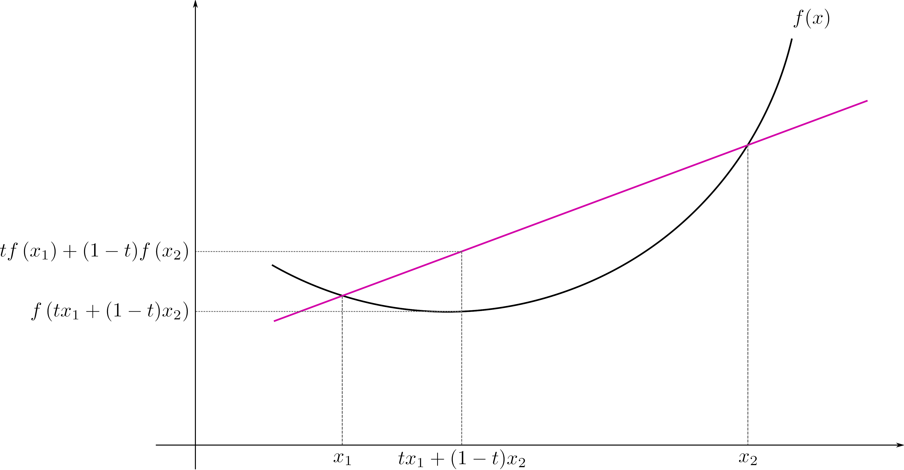
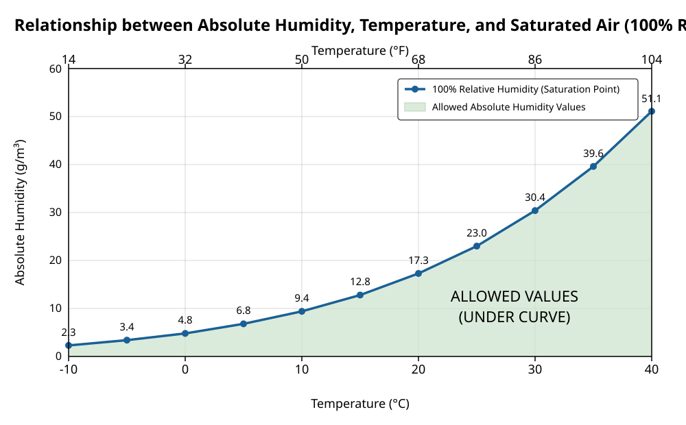

One of the unexpected roadblocks I experienced when writing this blogpost is that there's not a well-defined term for what I'm about to write. Apparently, neither my own language nor English have a special term for when you see your breath in winter. I always thought it's _mouth fog_ but beta teste... uhh, first-pass readers gave me early feedback on that. I'll use the term mouth fog, but feel free to hit me up with a more appropriate term.

Anyways: have you ever wondered why exactly do you see fog coming out of your breath when it's cold? I learned about this in a small sidenote in [Ahrens & Henson's Meteorology Today](https://www.google.com/books/edition/Meteorology_Today/jPWfzQEACAAJ) which I started reading during [my PPL studies](https://terra-incognita.blog/posts/learning-to-fly-through-windows-in-cloud). It all comes down to a math principle called Jensen's inequality.

## Jensen's inequality for people in a hurry

Imagine a graph of a function that is convex (i.e. curved upwards) on an interval $`[x_1, x_2]`$. If you were to connect the two endpoints of the graph with a line, that line would always be above the graph. The image from wiki makes it quite obvious: 

Now you might think something along the lines of "... well, _duuh_ ⁉️" but it turns out that 1) this is not that easy to prove, and more importantly 2) it's also a very general statement that can be applied in many ways for different classes of problems; I, for instance, first encountered it in my Probability class.

But for the purposes of this blogpost, it's enough to simply know that every point in the line connecting two points on a convex graph is always above the graph.

## Meteorology 101 for people in a hurry

Math, albeit fun, is not the whole story, we need to apply that math to something. And as things usually go in meteorology, that something is water vapor.
The air around us contains water molecules in a gas form that we can't see with our naked eyes. But it's there, and there's a limit how much water can be there.

Let's take a moment to go through the graph. The blue curve shows the maximum amount of water that can be contained in a cubic metre of air. That maximum is temperature dependent. The curve is non-linear, and _convex_: adding 5 C adds only 2g to the capacity at 0C (273K), but around 9g at 30C (303K). Of course the usual amount of water in the air is **below** the maximum (i.e. the air is unsaturated), which is good when, for example, it's hot and we want to sweat. We all likely know someone that is first to point out that the excessive heat we experience actually comes from the humidity.

Sometimes, though, things happen in such a way that the amount of water vapor in the air is **above** the maximum, i.e. the air gets oversaturated. Let's look at what happens when you breathe outside on a cold day.

The air inside your lungs is really warm and, due to the moisture inside the human body, really humid. Let's say it's 36C and about 40g/m3 of humidity. On the other hand, when the outside air is, say, -4C, we can only store about 1/10 of that, or 4g/m3. Now when we exhale, the 0.5L parcel of air from the lungs gets mixed with a 0.5L parcel of air from the outside. What we get is a parcel of air that has 1L, 16C and 22g/m3. And at 16C, the capacity of the air to hold water is around 13g/m3. Or, in other terms, a midpoint of the line connecting two points on a convex graph is above the graph :)

Mouth fog is what happens when there's too much water in the air for a given capacity of humidity. A really short explanation is that there's so much water that it starts condensing on every foreign thing in the air, usually dust, pollen or smoke. We call these particles condensation nuclei. Condensed water has different optical properties than gaseous water in the air, and that makes the water finally visible to the naked eye.

So next time you see fog coming out of your mouth, it's you and Mr. Jensen oversaturating the air with your moisture.
