[^1]Recently, I had a need for a new icon, to be used as a favicon and a profile pic for sites where I don't need to be professional. I had a simple set of constraints:
* Since my nick is `incognito` in most places that matter, I wanted the icon to be a fedora and glasses
* It should be pixel art
* The color palette should be red.

Naturally, given my (lack of)[^2] art skills, I turned to Gemini for help:
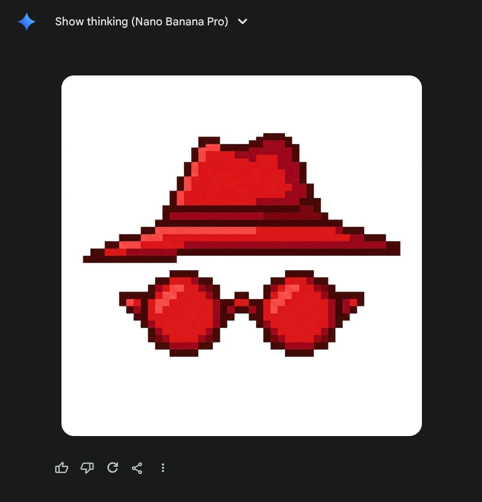
Nano Banana 2 Pro pretty much oneshotted what I wanted, and I was happy[^3] with my pixel art image... until I downloaded the image:
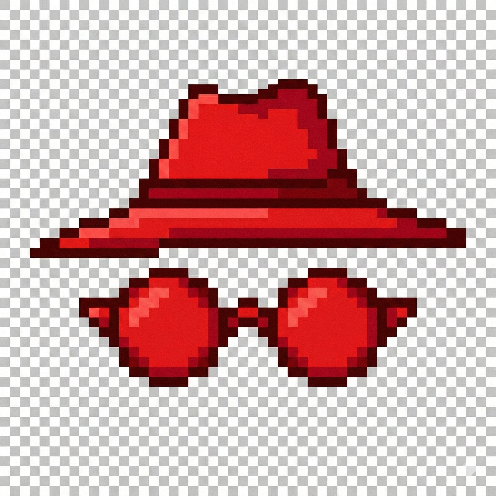

While it looks fine at a first glance, on a closer look, this particular image has several drawbacks:
1. While a human _could_ pick a few different shades of red and call it a day, it's actually dozens. Thousands, even. You can see it most easily if you focus really hard on large patches of color. You'll notice it's not actually the _same_ color, but incredibly similar shades of red. Wiping the screen does not help, I tried it.
2. For the detail oriented, you'll see that some pixels are not aligned with the checkerboard pattern, but rather _by half_: take for instance a closer look at the top right edge of the Hat. I tried painting it out manually, but honestly, it ruins the image :) so it should remain, but we should note that the pixels of the actual image are _twice as dense_, i.e. every image pixel is 2x2 square of actual pixels.  
3. Speaking of translucency background: it's not actually translucent :) open the image in a new tab and zoom -- this was the model's output. On one hand, impressive it can generate that background so regularly, on the other hand... it can do _that_ but no support for translucency??

So no, this is not really a pixel art image... but it's about to become one.

## Taking a red [PIL](https://pypi.org/project/pillow/)
That fact no. 3 is actually a dealbreaker for handling it with off-the-shelf software; I didn't find a good image palette software that lets me pick transparency shades. So I decided to put my image processing degree to good use and roll my own :)

Basic facts about the image above so far:
* 2048x2048 pixels image, with a 50x50 checkerboard pattern of **fake translucency.**
* This implies every square is 41x41... but wait! Fact no. 2 implies we should make the grid finer by a factor of 2, so every target pixel is actually 20.5x20.5 square of the original image pixels (and there are 100x100 of them). The .5 is mega inconvenient but we'll work around it.
* We should reduce the number of colors by grouping similar shades together. In the field of image processing this is popularly called [color quantization](https://en.wikipedia.org/wiki/Color_quantization), usually solved by clustering algorithms.
* I want to introduce an actual translucency where the pixels are white and gray

We're going to do the following:
- Split the original image into virtual pixels
- Calculate the color of all virtual pixels
- Cluster the colors
- Mark the white and gray clusters as translucent and assign the cluster centre for all points in respective clusters
- That's it, I should then write the 100x100px image to disk.

## Around the inconvenience
So, for every 41x41 image square (Big Square) I have 4 "virtual" pixels of the resulting image (Smol Square). It's not straightforward how to sample 20.5x20.5px Smol Square from the Big Square _directly_. Therefore I decided to kinda cheat a little bit: I'm going to sample 21x21 Smol Squares from every Big Square such that they share the middle row/column, and then I'll average all the values inside. I rationalized this to myself by noticing that _most_ Big Squares have a uniform color which is really similar to that of the pixel in the middle, and those Big Squares that don't (eg top of hat), well one pixel won't hurt anybody. I think. This is how Big Square pixelization looks like on a uniformly gray square:

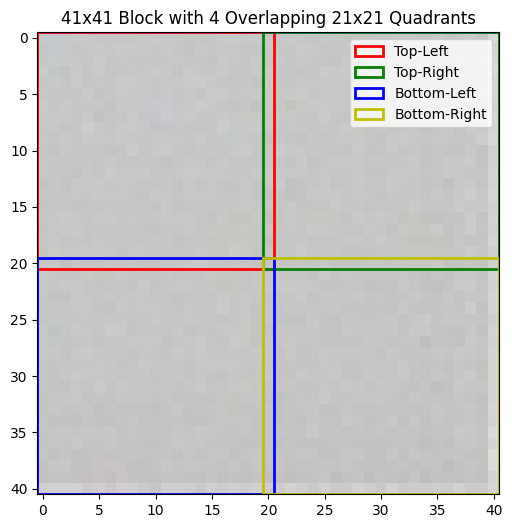

and this is an example of a Big Square where pixels cut in half (upper right corner of the fedora):

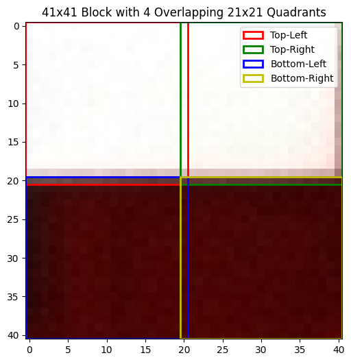
You can totally see now how the colors are _not_ uniform, but also, how sampling the edges introduces subtle errors.

## Clustering time

Now that we have the 100x100 virtual pixels average, let's see how they look like. It's kinda hard to plot points in 3 dimensions (and even harder to embed a 3D visualization into this blog![^4]) so I did the second best thing which is to reduce data dimensionality to just 2 using [PCA](https://en.wikipedia.org/wiki/Principal_component_analysis):

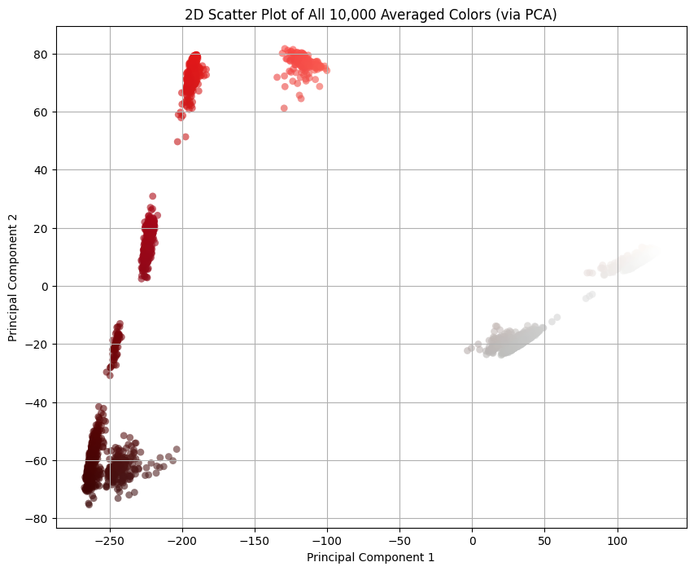
There are 7 prominent clusters, but their shapes are weird... and it's all my fault.

I averaged the colors of pixels within a Smol Square. Every good statistician knows that the mean, as a metric, is susceptible to outliers, and that one pixel I mentioned before seems to be messing with the distribution of colors. Good statisticians also know that, in presence of outliers, a better metric is median, so let's switch to that:

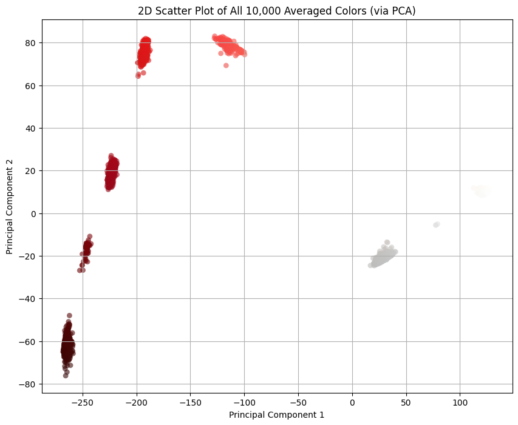
Better. Not by a lot, but better, especially the lower left cluster.

Also the thing we get for free is that there's clear line separating the pixels that should be transparent and the others: $`PC_1=-50`$. Everything to the right should be transparent, and everything to the left we should cluster. (By the way, I was pre-worried about this part because I didn't know how difficult would it be to separate the colors. If it were more difficult than this, I would have fitted an SVM classifier or something. This turned out to be easy mode.)

Let's filter those out and re-PCA the remaining colors:

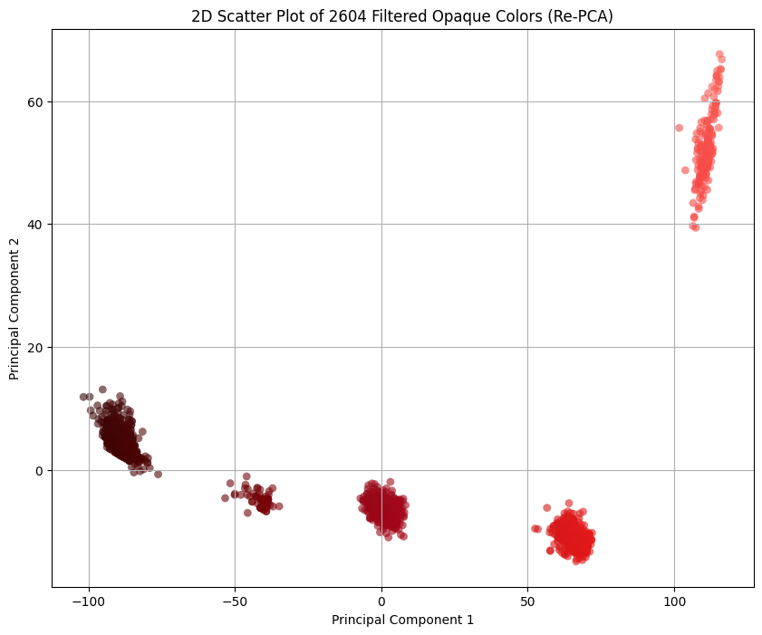
Nice. We see 5 well defined clusters, 4 with somewhat regular shapes and 1 Chile-shaped long boi.

## Clustering lab
The idea behind the color clustering, i.e. grouping colors by similarity, is deceptively simple. The main questions are 1) how do we measure similarity between two colors, and 2) whether Euclidean distance in RGB captures color similarity.

The answer to 2) is no. The theory is a bit involved, but TL;DR is that RGB color space is not uniform[^5] and we need a non-linear perceptually-uniform color space for the Euclidean distance to work as a color similarity metric. Luckily for us, people solved this problem in 1970's and the name of the solution is [CIELAB](https://en.wikipedia.org/wiki/CIELAB_color_space). That's what we'll be using in clustering for calculating the distance.

Regarding clustering itself: I didn't really put much thought on the pick of the clustering algorithm. This is not a difficult problem: I have ~2600 3-dimensional data entries, I have a Euclidean distance metric in that space, and I need cluster centres for the followup analysis; if there ever was a more appropriate situation to use K-means clustering, please let me know. Until then, I'll assume this was. 😁

### Eating my own dog food: it sucks
K-means clustering depends on the choice of the hyperparameter K, the number of clusters. While we know there are 5 clusters from the previous visualizations, I wanted to do a hyperparameter sweep anyways to [dogfood](https://en.wikipedia.org/wiki/Eating_your_own_dog_food) my elbow/knee picking library, [knarrow](https://github.com/InCogNiTo124/knarrow). The idea is to pick various `K`-s and see how clustering behaves, what's the "error" for every K.

I discovered two issues with my library, one purely technical, and the other more on the human side.

I built the library in order to practice implementing various approaches to the knee picking. It was fun, but I focused so much on the development of all those approaches that I never considered how would the user see the library. It turns out the end user doesn't really care about picking algorithms, they just want to get the knww. I didn't want to _have to_ try all my algorithms and see which one is the best. So I had a little yak shaving session where I implemented a voting approach: run all the algorithms and vote for the best knee. This resulted in [this PR](https://github.com/InCogNiTo124/knarrow/commit/9a4215d2c1801c19d2192415a8a45c37017b0364), and I'm slightly sad it took so much time for me to figure that out.

That was the technical issue. The human issue is that the output is simply _wrong_. I consistently got K=4 as the "mathematically optimal" number of clusters, but we can tell that's not the case by, well, _looking at the clusters ourselves_. This happens, by the way, because I explore K's in range 2..15 and K=2 proves to be a big outlier. If I ignore the K=2 and explore K's in 3..15, then the "mathematically optimal" number of knees truly comes out as K=5. You can redo the analysis yourself with [my ipynb](https://github.com/InCogNiTo124/moonrepo/blob/main/personal-blog/database/posts/pixelizing-my-new-favicon/rasterize.ipynb), but my conclusions are: 1) human judgement beat automation in this instance, and 2) I seriously started doubting the elbow finding method _in general_, as it seems to **depend on the context** of picking the search range, and not the **clustering problem itself**.

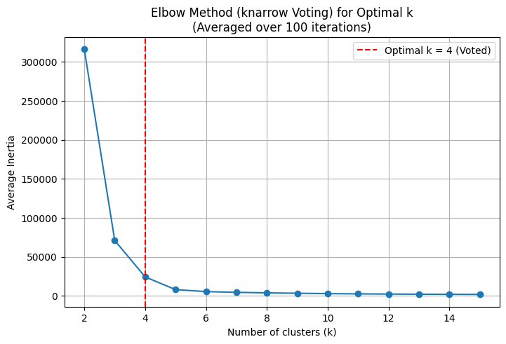
## Show me the clusters
Once we cluster all the colors, we assign the centroid of that cluster to every pixel. Below we see a subset of the hyperparameter sweep K in range from 3 to 8.

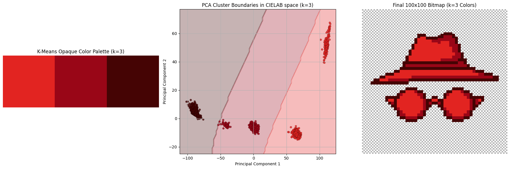

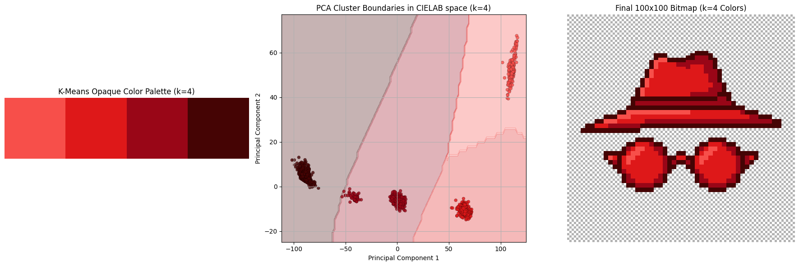

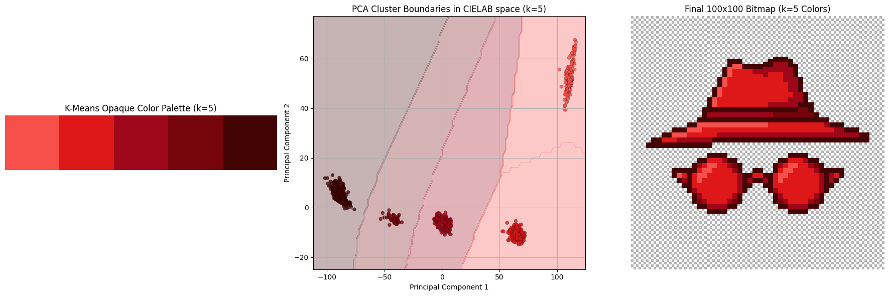

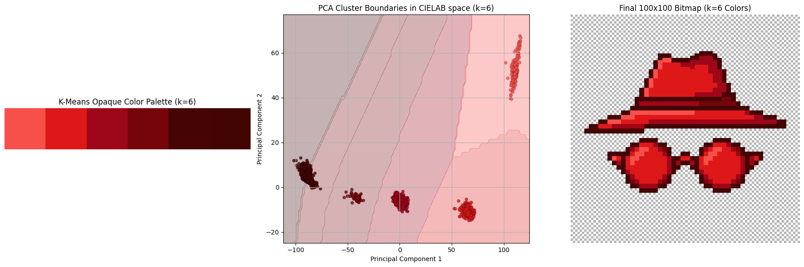
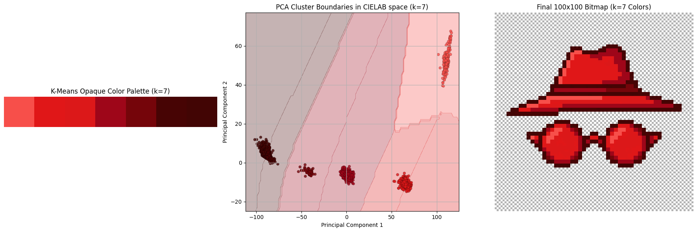
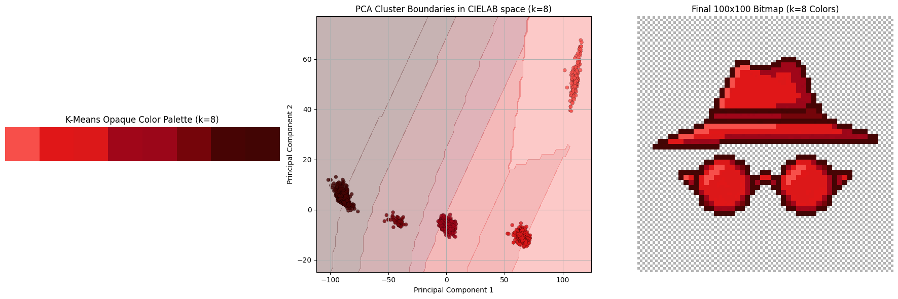
Turns out both K=4 and K=5 are good options. I liked K=5 better but since I'm not that detail-oriented I couldn't figure out why. Try to find the differences yourself, the explanation is below.
{: style="image-rendering: pixelated;" }
{: style="image-rendering: pixelated;" }

 
  
Explanation of differences

  <figure>
    
    <figcaption>Map showing RGB difference between the two images. Largest differences are in the darker regions of fedore (shadow?) + details around the glasses</figcaption>
  </figure>

The final colors in the 5-color palette are:
- `rgb(247, 79, 74)`: lighting oriented parts
- `rgb(222, 24, 25)`: default color
- `rgb(158, 6, 25)`: shadow: lighter
- `rgb(117, 5, 10)`: shadow: darker
- `rgb(69, 4, 4)`: the outline

---

## Appendix I: storing it optimally
It wouldn't be my blog if I didn't talk about optimization of some sort, would it? 🙂

You see, the default way the PNG is stored is by directly referencing RGBA pixel values (a sequence of which is first pre-compressed with a prediction method, and then compressed via DEFLATE, [according to wiki](https://en.wikipedia.org/wiki/PNG#Compression)). Since we know there's a palette of 5 colors (+ transparency) we can totally just store the image in the indexed color mode: we store the palette and the pixel values are just indices of the palette! This is how it looks like:
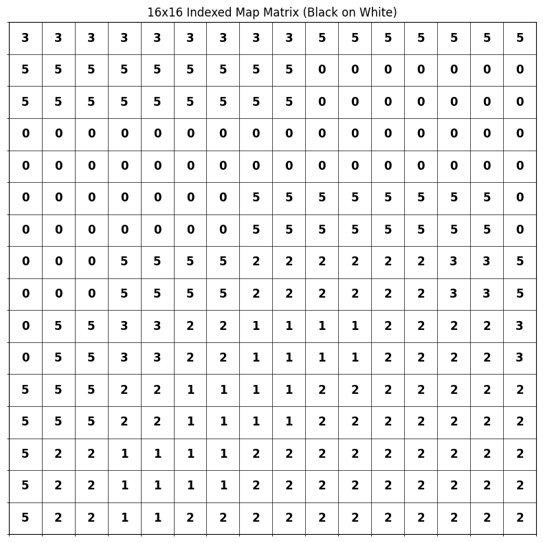
You can also see how the numbers group into 2x2 squares, because of our sampling scheme from the beginning[^6].

I managed to save 45% of storage space with this:
 is a cool command line calculator written in Rust. It's like a better `bc`.](Pasted image 20260503183635.png)
and the resulting image (binary) is:
{: style="image-rendering: pixelated;" }
---

## Appendix II: websafe
For some inexplicable reason, I'm always pulled back to [websafe colors](https://en.wikipedia.org/wiki/Web_colors#Color_table), a special subset of 216 colors deemed "safe to be shown reliably in all web browsers", back when web browsers were a new thing and dinosaurs roamed the planet. There's absolutely no need for those now, and there hasn't been a need for probably 30 years. And yet, I like them.

I present to you, for no reason at all, the same image as above, just with a websafe palette.
{: style="image-rendering: pixelated;" }
This was obtained by rounding all of the RGB components to the nearest of: 00, 33, 66, 99, CC, FF. Apparently, that boils down to finding the nearest multiple of 51.

Doesn't look _that_ bad, but it's too strong for my taste.

[^1]: I dedicate this blogpost to my late mentor, prof. dr. sc. Siniša Šegvić. Every time I do image processing, I remember how we lost you too soon. Thanks for everything, rest in peace.

[^2]: I'm not that interested in developing them, though

[^3]: Admittedly, I don't have visual taste. I don't know how to evaluate this picture, which questions should I ask, or which dimensions should be important, except "matches criteria" and "it's pretty to me".

[^4]: this better not awaken any new project ideas in me

[^5]: Due to imperfectness of human vision, colors that are separated by distance of e.g. 20 in RGB can look from very different to not at all (and everything in between), depending on the color; human vision is most sensitive around green hues so color differences of shades of green are more pronounced than, say, of blue shades.

[^6]: I want to fix that 0.5 alignment so badly but, again, mathematical purity results with inferior visual appeal, as we saw with clustering.