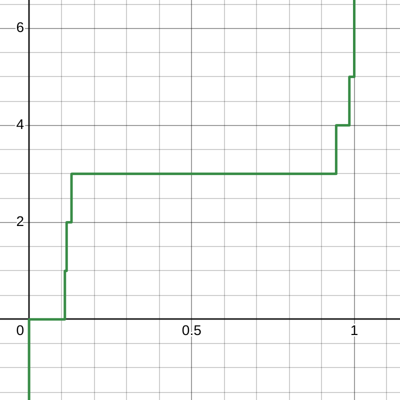

# Sampling a categorical PMF: more than meets the eye

Sampling a sample from a distribution appears in a lot of places in natural
sciences, but lately it's mostly been used to power LLMs, due to how the
Transformer architecture works internally. This blogpost will talk about how to
efficiently sample from a categorical distribution given logits.

## The naive way

Mathematically, most general method to sample a categorical distribution is to
sample from its quantile function. A quantile function is the inverse of the
cumulative distribution function (CDF), and CDF for a particular value $`x`$ is
defined as the sum of PMF probabilities for all the values less than $`x`$.
Usually, though, LLMs output logits and not PMF, so we need to calculate PMF
from the logits using softmax. Lots of fancy words, so let's see an example:

```python
import numpy as np

logits = [4, 1, 2, 6, 3, 2]
a = np.array(logits, dtype=np.float64)
E = np.exp(a)
pmf = E / np.sum(E)
print(pmf)
# array([0.00548473, 0.11016379, 0.01490905, 0.8140064,
# 0.04052699, 0.01490905])
cdf = np.cumsum(E)
print(cdf)
# array([0.00548473, 0.11564852, 0.13055757, 0.94456396,
# 0.98509095, 1.        ])
```




In order to actually sample from the example distribution, we'll sample
uniformly from 0 to 1 (also known as the unit uniform) and search the
corresponding value in the quantile function.

_Another_ way of thinking is this way: choose a random value between 0 and 1 on
**the vertical, y axis of the CDF** and then you search **the horizontal, x axis
of the CDF** for the value that corresponds to the chosen random value. For
example, sampling 0.5 results with 3 (this is supposed to happen in 81.40% of
cases), and sampling 0.111 results with 1 (this is supposed to happen in 0.55%
of cases).

In software, though, we don't have a neat way to represent this quantile
function. Usually, after generating a uniform sample, the CDF is searched for
the first value larger than the sampled one, ideally with binary
search.[^search]

So with a Python-esque pseudocode, this procedure can be described as:

```python
def sample(logits):
  # O(n)
  exps = [exp(x) for x in logits]

  # O(n)
  denom = sum(exps)

  # O(n)
  probs = [x/denom for x in exps]

  # O(1), probably
  sample = Uniform(0, 1).sample()

  # O(lg(n)), hopefully
  index = search_for(sample, probs)
  return index
```

This _will_ work... but at what cost? We're traversing the `logits` vector no
less than 3 times[^stable] just to obtain the probability mass function, and
only after then do we do the search, which requires at least one more search to
get the CDF.

## A better way

If you don't already know, at this point you could probably guess there is a
better way to sample a categorical distribution given the logits. Ideally, it
would work without the obvious bottleneck step of calculating the PMF from the
logits.

Luckily for us, the people have already worked out the math for this one - it's
called a
[Gumbel max trick](https://web.archive.org/web/20230622032812/https://homes.cs.washington.edu/~ewein//blog/2022/03/04/gumbel-max/).
While the notation may appear daunting, the math isn't _that_ involved,
considering the result that's proved. It turns out you can sample from a
categorical distribution **directly from the logits** (and, in a single pass,
too!) just by adding samples of a standard
[Gumbel distribution](https://en.wikipedia.org/wiki/Gumbel_distribution) to the
logits, and storing where the largest sum was. And, as per the Wiki article,
sampling the standard Gumbel distribution is as easy as

```math
G=-\ln(-\ln(x))
```

where $`x`$ is $`\text{Uniform}\left(0, 1\right)`$. Beautiful :heart:.

The Python-esque pseudocode is as straighforward as it gets:

```python
def sample(logits):
  # lowest number there exist
  max = -inf
  max_i = 0

  # O(n)
  for i, x in enumerate(logits):
    # O(1), probably
    G = Gumbel(0, 1).sample()
    if x+G > max:
      max = x+G
      max_i = i
  return max_i
```

The cool thing is we've inlined the search for the sample within a single pass.
No more unnecessary passes and nuking the processor caches!

On the other hand, for every iteration we do a bit more work by sampling from
the Standard Gumbel distribution. Let's find out if it's significant!

## Experiments

Testing things and quantifying their effects is definitely one of my most
favorite things to do.

First, let's measure the goodness of fit. I wrote a script that samples from a
distribution and checks if samples fit the theoretical.

```python
if __name__ == "__main__":
  for k in (5, 10, 50, 100):
    total_count = 5000 * k
    logits = [random.random() for _ in range(n)]
    expected_freq = [t * total_count for t in categorical(logits)]
    samples = [0] * k
    for _ in range(total_count):
      i = sample_gumbel(logits)
      samples[i] += 1
    result = scipy.stats.chisquare(samples, expected_freq, ddof=k - 2)
    print(f"cumulative, linear, k={k}, p_value={result.pvalue}")
```

Before revealing the results, a small discussion about `ddof`: it means "delta
degrees of freedom" and is meant to be used when you're estimating the
parameters of the distribution. There's `k-1` degrees of freedom by default,
meaning that for 6-valued categorical distribution, the test statistic chi2 has
5 degrees of freedom. However, one could argue that I'm estimating **almost all
of the parameters**: if a categorical distribution has 6 values, I need to
specify only 5, because the last one is $`1-\sum\left(\text{others}\right)`$.
That means the degrees of freedom should always be 1. The delta of degrees of
freedom is therefore a solution of $`1=k-1-\text{(ddof)}`$.

The results are as follows:

```text
cumulative, lg2, k=5, p_value=0.00019925739287637194
cumulative, lg2, k=10, p_value=0.008461415566727616
cumulative, lg2, k=50, p_value=7.124183672561275e-12
cumulative, lg2, k=100, p_value=6.995927907952046e-24

cumulative, linear, k=5, p_value=0.0328113340380732
cumulative, linear, k=10, p_value=0.0007787471757505004
cumulative, linear, k=50, p_value=3.897773339242245e-09
cumulative, linear, k=100, p_value=6.67085374753579e-29

cumulative, gumbel, k=5, p_value=0.024586426885631972
cumulative, gumbel, k=10, p_value=0.002726706790486292
cumulative, gumbel, k=50, p_value=1.8746773795404964e-15
cumulative, gumbel, k=100, p_value=4.6684047775788335e-31
```

To my naked untrained eye, this seems statistically significant.

For measuring the actual speed of sampling, I modified the script to create
logits with some interesting dimension sizes and measure sampling speed:

```python
...
sizes = (
    list(range(2, 10))
    + list(range(10, 100, 10))
    + list(range(100, 1000, 100))
    + list(range(1000, 10_000, 1000))
    + [10_000]
)

for n in tqdm.tqdm(sizes):
  for _ in range(10_000):
    logits = [random.random() for _ in range(n)]
    start = datetime.now()
    sample_gumbel(logits)
    time_delta = datetime.now() - start
    us = time_delta.microseconds
    # store us
    ...
```

Time to run! Timing the script runtimes should be a sanity check of our claims
that the gumbel trick speeds things up. Inspect the timings carefully:

```console
❯ time py sampling_gumbel.py
python3 sampling_gumbel.py  73.66s user 0.03s system 102% cpu 1:13.45 total
❯ time py sampling_linear.py
python3 sampling_linear.py  64.46s user 0.04s system 102% cpu 1:03.11 total
❯ time py sampling_lg2.py
python3 sampling_lg2.py  59.40s user 0.01s system 102% cpu 58.008 total
```

[\*record screech\*](https://youtu.be/sy_Aje0hnac?t=6)

... wait a second. Why does the Gumbel-trick sampling have the longest total
runtime? I expected it to be the fastest![^anger] This should not be
happening[^denial].

Maybe it's just for the total :smile: maybe most of the time it really is faster
... [^bargain] Let's plot the values with respect to the number of categorical
dimensions:


And this is a summary of linear regressions fitting:

```console
method=lg2
coef=0.06403413031829312
intercept=0.7498273801200668
R2=0.9999879315657421

method=linear
coef=0.07284179397885818
intercept=0.0899031120106315
R2=0.999994925648005

method=gumbel
coef=0.09117484397945508
intercept=-0.26593860287300686
R2=0.9999685320065995
```

Oh no... The $`R^2`$ does not lie... Gumbel trick sampling adds 9 microseconds
per 100 dimensions, as opposed to softmax-then-linear-or-log search which add
7.3 and 6.4 microseconds, respectively. Something is terribly
wrong[^depression].

## Profiling Gumbel

Let's turn to profiling why the Gumbel sampling script is so slow. For that,
I'll use the trustworthy `cProfile` Python module.

```console
$ python3 -m cProfile sampling_gumbel.py
2400977993 function calls (2400974614 primitive calls) in 257.503 seconds
Ordered by: cumulative time

     ncalls  tottime  percall  cumtime  percall filename:lineno(function)
      27/26    0.000    0.000  457.539   17.598 threading.py:637(wait)
      26/25   29.408    1.131  250.130   10.005 threading.py:323(wait)
     360000  108.327    0.000  190.104    0.001 sampling.py:50(sample_gumbel)
 1199880008   56.947    0.000   56.947    0.000 {method 'random' of '_random.Random' objects}
 1199880002   54.208    0.000   54.208    0.000 {built-in method math.log}
    108/102    7.321    0.068   50.046    0.491 {method 'acquire' of '_thread.lock' objects}
      131/1    0.000    0.000    7.303    7.303 {built-in method builtins.exec}
        2/1    1.067    0.534    7.303    7.303 sampling.py:1(<module>)
~~~output cropped~~~
```

Oh no.[^denial]

I don't know what all the `threading` and `lock` invocation mean (I presume it's
the `cProfile` or `tqdm` progress bar), but it turns out `math.log()` gets
called _~1.2 billion times_ and accounts for 54 seconds of profiling runtime,
which amounts to about 20% of the total runtime. Well shit, this can't be fixed,
I absolutely do need the log to sample Gumbel... [^depression]

... or do I?[^bargain]

## Hello, Padé, my old friend

Let's try to evaluate the Gumbel QF as directly as possible but without using
$`\ln()`$. The first instinct is to develop the Taylor series of the function
and to evaluate the resulting polynomial.[^maclaurin] However, the Gumbel QF is
a diverging function for both left and right limits and there exists a much
better approximation of such functions:
[Padé approximants](https://en.wikipedia.org/wiki/Pad%C3%A9_approximant).

There's plenty of literature on them, but in short, you represent a function as
a rational function of two polynomials. The two "hyperparameters" are the degree
of the numerator polynomial and the degree of the denominator polynomials. Once
you decide on those two, the polynomials can be ~easily calculated from the
coefficients of Taylor polynomials. Luckily, there are tools that can do that
for us nowadays. Here's the following python script:

```python
import sympy
import numpy as np
import scipy

e = sympy.E

# WolframAlpha + Gemini
# Taylor coefficients
coefficients = [
    0,                      # x^0
    e,                      # x^1
    0,                      # x^2
    e**3 / 6,               # x^3
    -e**4 / 24,             # x^4
    e**5 / 15,              # x^5
    -13 * e**6 / 360,       # x^6
    97 * e**7 / 2520,       # x^7
    -571 * e**8 / 20160,    # x^8
    1217 * e**9 / 45360,    # x^9
    -3391 * e**10 / 151200  # x^10
]
coefs = [float(t.evalf()) if hasattr(t, 'evalf') else t for t in coefficients]

EPS = 0.02  # numerical stability
delta = float((1/e).evalf())
errors = []
for deg_numer in range(1, 5):
  for deg_denom in range(1, 5):
    # pade approximant polynomials
    p, q = scipy.interpolate.pade(coefs, deg_numer, deg_denom)

    # error function
    f = lambda x: (-math.log(-math.log(x)) - p(x-delta)/q(x-delta))**2  # squared error

    # "RMSE"
    error = scipy.integrate.quad(f, EPS, 1-EPS, limit=100)[0] ** 0.5  # sqrt of integral

    errors.append((abs(error), (deg_numer, deg_denom)))

errors.sort()
print(errors[:3])

# outputs:
# [
#   (0.05273774642270674, (4, 1)),
#   (0.06859734330880154, (4, 4)),
#   (0.0706887022917013, (2, 3))
# ]
```

The winning polynomial:

```math
f(x)=\frac{ex}{-\frac{7e^4}{180}x^4+\frac{e^3}{24}x^3-\frac{e^2}6x^2 + 1}
```

(I expected `(4, 4)` to win but, alas, there seems to be no end to surprises
tonight.)

In order to test whether or not it helped, let us try to sample some random
distributions with the following snippet:

```python
...

def eval_gumbel_direct(x):
    delta = 1 / math.e
    q4 = -7 * math.e**4 / 180
    q3 = math.e**3 / 24
    q2 = -(math.e**2) / 6

    # 1. move the x to 0
    x -= delta
    # 2. apply the polynomial
    numerator = math.e * x
    # Horner's method!
    denominator = ((((q4 * x) + q3) * x + q2) * x) * x + 1
    return numerator / denominator


def sample_gumbel(logits):
    max = -float("inf")
    max_i = 0
    for i, x in enumerate(logits):
        # G = eval_gumbel_log(random.random())
        G = eval_gumbel_direct(random.random())
        v = x + G
        if v > max:
            max = v
            max_i = i
    return max_i
...
```

The results speak for themselves :sweat:


$`R^2`$ also strongly suggests the slowdown:

```console
method=lg2
coef=0.06403413031829315
intercept=0.7498273801200099
R2=0.9999879315657421

method=linear
coef=0.0728417939788582
intercept=0.08990311201058887
R2=0.999994925648005

method=gumbel
coef=0.09117484397945513
intercept=-0.2659386028730637
R2=0.9999685320065995

method=gumbel_direct
coef=0.30988638402163726
intercept=-1.5539478609473463
R2=0.999986189921298
```

To really drive the point home, let's take a look at a the `cProfile` of a
direct Gumbel method:

```console
1801071959 function calls (1801068537 primitive calls) in 425.219 seconds

   Ordered by: cumulative time

   ncalls  tottime  percall  cumtime  percall filename:lineno(function)
    44/43    0.001    0.000  745.302   17.333 threading.py:641(wait)
    43/42   41.122    0.956  420.220   10.005 threading.py:327(wait)
   360000  135.823    0.000  334.236    0.001 sampling.py:69(sample_gumbel)
599940000  165.095    0.000  165.095    0.000 sampling.py:54(eval_gumbel_direct)
  176/171   12.986    0.074  100.113    0.585 {method 'acquire' of '_thread.lock' objects}
1199880008   69.314    0.000   69.314    0.000 {method 'random' of '_random.Random' objects}
    138/1    0.000    0.000    4.911    4.911 {built-in method builtins.exec}
      2/1    0.628    0.314    4.911    4.911 sampling.py:1(<module>)
       14    0.001    0.000    0.270    0.019 __init__.py:1(<module>)
~~~output cropped~~~
```

Just evaluating gumbel takes ~165s, and amounts to a staggering 44.8% of
runtime.[^depression]

<!-- prettier-ignore -->
{: style="height:250px;width:250px"}
<br/> <br/> <br/> <br/>

<hr/>

... However, still not everything is lost so I shall not give up just yet. I
noticed a particular flaw in my sampling implementations, which is _using
function calls_ to implement various details. While seemingly not an issue at
all (I mean, how else am I going to program??),
[function calls are pretty expensive in Python](https://stackoverflow.com/a/14648595).
Interpreting a source code will do that to the runtime &mdash; I need to write
something which will compile and be blazingly fast.

A perfect excuse to hone my Rust skills. :upside_down_face:[^bargain]

## Bye Py, must Rust

I admit right now I don't know much about profiling Rust (or other compiled
languages, for that matter) so it may be that the numbers I'll show next have a
deep flaw somewhere beyond my circle of competence. I did the best I knew, which
is (the same as Python): measure the time it takes for the function call to
return an index, and average it out over 10k iterations.

The code is just slightly above the the-simplest-it-gets:

```rust
use std::time::Instant;

fn main() {
  let mut rng = rand::thread_rng();
  ...
  for n in values {
    let mut sum = 0;
    for _ in 0..10000 {
      // create logits
      let mut logits = (0..n).map(|_| rng.gen()).collect::<Vec<f64>>();

      // measure
      let before = Instant::now();
      let sample = sample_linear(&mut logits, &mut rng);
      // let sample = sample_lg2(&mut logits, &mut rng);
      // let sample = sample_gumbel(&mut logits, &mut rng);
      // let sample = sample_gumbel_direct(&mut logits, &mut rng);
      let duration = before.elapsed();
      sum += duration.as_micros();
    }
    // calculate
    let avg = (sum as f64) / 10000.0;
    data.x.push(n);
    data.y.push(avg);
  }

  write_data_to_file(&data)
}
```

The Rust implementations of all 4 of the sampling methods can be found
[here](https://github.com/InCogNiTo124/personal-blog/blob/ba24a3f/posts/sampling/rustsampler/src/main.rs#L18-L91),
but they're also pretty straightforward.

There are the graphs for `cargo run` timings:


Still no dice.[^depression] However, the situation finally changed once I
remembered there's an `--release` flag in the `cargo run` command which applies
optimizations.[^bargain] The final graphs are:


And for completion here's the relevant statistics:

```console
method=lg2
coef=0.003884914526988602
intercept=-0.5248485332023876
R2=0.9999880643180946

method=gumbel_direct
coef=0.0040038495294392
intercept=-0.29117474638573526
R2=0.999996590044896

method=linear
coef=0.004129547444205475
intercept=-1.415892600042227
R2=0.9999143976325533

method=gumbel
coef=0.016904136830335474
intercept=-0.11869034950416335
R2=0.9999994563520309
```

We can see that 3 out of 4 methods introduce 4us of extra time per 1000
dimensions, but they're all pretty similar.

## Conclusion

- While the theory works out nicely such that we don't require multiple passes
  over the data, in practice the gains are negative. All the extra work
  outweighs the gains[^accept]
- Obtaining samples from a Gumbel distribution seems to be the bottleneck. If we
  ever find a way to sample the Gumbel cheaply, this method may become relevant
- Obtaining samples can be hacked via Pade approximants but this might
  underrepresent low probability categories; I guess it does not matter for
  sampling in the LLMs which look for the max probabilities anyways, but I
  wouldn't use it for anything where statistics is more important
- More tests on different hardware should be done. Perhaps the situation is
  different when running on nVidia GPUs and CUDA? I have no skill there but it
  may be worth a try.
- This is one of those cases were a simple approach really is the best.

[^search]:
    This algorithm is well suited for not-large, 0-anchored, consecutive-valued
    categorical variables. In case you have values 3, 1M and 10B, you're
    probably better off using a binary tree or a similar structure.

[^stable]:
    Actually this naive implementation of softmax has numerical stability
    issues. For a numerically stable solution, _yet another_ traversal to find
    the max is necessary

[^anger]: Anger
[^denial]: Denial
[^bargain]: Bargaining
[^depression]: Depression
[^accept]: Acceptance
[^maclaurin]:
    Actually, for numerical stability, I'll implicitly move the function such
    that f(0)=0 and not 1/e as is the default. That makes it a MacLaurin series

[^top10]:
    Top-10 stat betrayals, together with
    [the variance estimator being biased](https://en.wikipedia.org/wiki/Bias_of_an_estimator#Sample_variance).
